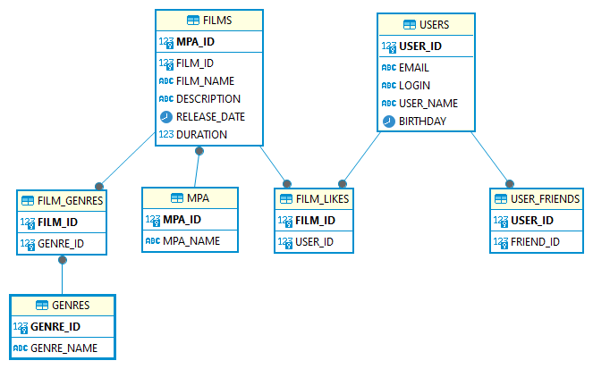

# java-filmorate
## Repository for Filmorate project.

#### Database diagram


#### Description
Table FILMS linked with FILM_GENRES, FILM_LIKES by FILM_ID; 

Table GENRES linked with FILM_GENRES by GENRE_ID;

Table MPA linked with FILMS by MPA_ID as a foreign key;

Table USERS linked with USER_FRIENDS by USER_ID and with FILM_LIKES as a foreign key;


###### SQL script example

Get concat field GENRE_ID and GENRE_NAME from GENRES table:
```
SELECT GENRE_ID, CONCAT_WS(',', GENRE_ID, GENRE_NAME) AS CONC_GENRE
FROM GENRES AS GENRE_CONCAT;
```
Join GENRE_CONCAT to FILM_GENRES table with add GENRE_CONCAT to new field FILM_GENRES as ARRAY:
```
WITH 
GENRE_CONCAT AS (
SELECT GENRE_ID, CONCAT_WS(',', GENRE_ID, GENRE_NAME) AS CONC_GENRE
FROM GENRES
)
SELECT FILM_ID, string_agg(gc.CONC_GENRE, ';') AS FILM_GENRES
FROM FILM_GENRES fg 
LEFT JOIN GENRE_CONCAT as gc
ON fg.GENRE_ID = gc.GENRE_ID
GROUP BY fg.FILM_ID)
```
Joining with FILMS table with add new fields from other tables, include MPA table at end

```
WITH 
GENRE_CONCAT AS (
SELECT GENRE_ID, CONCAT_WS(',', GENRE_ID, GENRE_NAME) AS CONC_GENRE
FROM GENRES
),
FILM_AGG_GENRES AS (
SELECT FILM_ID, string_agg(gc.CONC_GENRE, ';') AS FILM_GENRES
FROM FILM_GENRES fg 
LEFT JOIN GENRE_CONCAT as gc
ON fg.GENRE_ID = gc.GENRE_ID
GROUP BY fg.FILM_ID)
SELECT f.FILM_ID, f.FILM_NAME, f.DESCRIPTION, f.RELEASE_DATE, f.DURATION, f.MPA_ID, m.MPA_NAME, fg.FILM_GENRES 
FROM FILMS AS f 
LEFT JOIN FILM_AGG_GENRES fg ON fg.FILM_ID = f.FILM_ID
LEFT JOIN MPA AS m ON f.MPA_ID = m.MPA_ID;
```